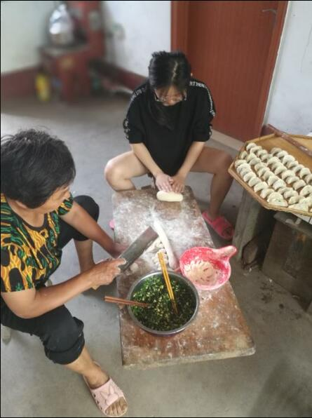
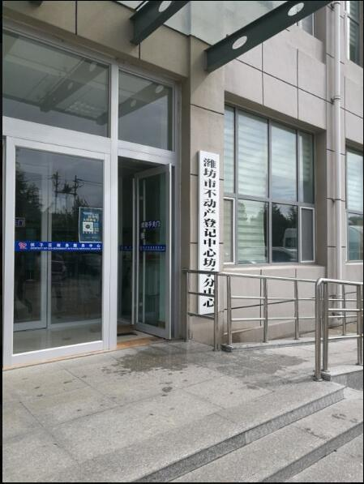
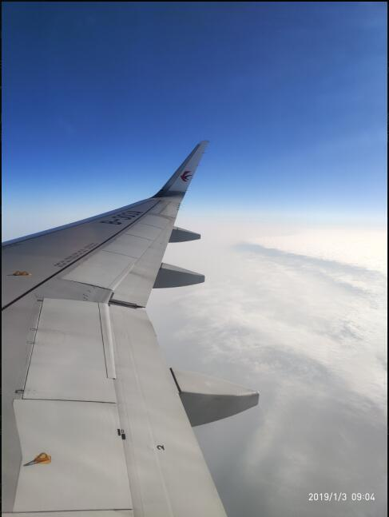
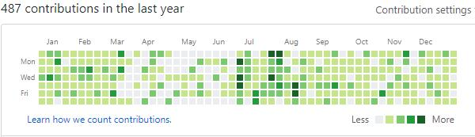

2018年已经过去了，又到了一年一度的人类日常总结大会。我也拣在这一年中的一些事情陈述下，好在多年之后回头看，能回味这改变人生的一年。

回顾:

2018年春节过后的第一个工作日提了离职，准备从济南来北京，做出这个决定，也是根据自身的实际情况来分析的。春哥要读研究生了，虽然现在国内读研究生花不了多少钱，但是在济南的工资完全没法支撑我和春哥的开销；也要考虑以后的事情，毕竟已经长大了，房子车子，哪一个不是吸金的主啊；济南的房价已经15k左右了，一个月5k的工资，根本没有奋斗的欲望；济南这里夏天太热，冬天又雾霾特别重，实在挺烦人的；等等。大概就是这几点吧，因此和春哥商量决定，春哥南下读研这段时间，我北上负责赚钱，为以后的生活赚点费用。

2018年3月18日，纠结了这么多天，终于踏上了北上的火车。

    

来了北京，面试了一周，一天有时候面4家，累的不行，以后面试一天还是一家比较好，要不然得把自己累死。面试的时候，进行到hr阶段，听说是济南过来的，就是压薪资模式了。刚从二线来，确实吃亏啊。现在后头看，对于招我的完全是低薪捡便宜货啊，看公司里比我工资高，而且简历作假，bug不断的人才，真是层出不穷。大概这也是必经之路吧，我不拒绝，继续学习，找到我能发光发热，也认可我发光发热的地方。

时间来到了端午节，带着春哥回家了，傻春见公婆。带她去汶河转了转，问她过年来不要来过年呢，她说“怕害羞”。

    

8月中旬，挖空三个钱包在潍坊上车，因为不知道以后会在什么地方定居，感觉先在老家上车，也是最保险的，等春哥，研究生毕业，如果马上结婚，也不会没有婚房，低端人口也有低端人口的活法吧。

    

8月24日搬家，从天通苑北的小村子，搬到了南三环的木樨园，虽然距离远了，小强横行，但是也是为冬天做准备，生活便利不就是城市的魅力之一么。

十月一假期去了烟台，来到了春哥家，经历的小事，春哥的正义感依然爆棚。下图是一个小朋友钻进了抓娃娃机，春哥主动救援，并把小孩子救了出来。但是在救援过程中，春哥被划伤了手臂，我的一个上衣，被路人顺走。

    

19年元旦去汕头找春哥，也算是今生最远的旅程了。纪念下第一次坐飞机。

    

磕磕绊绊的2018就这样走过了，最后放一张图，让自己继续努力。2019要加油呀！

    

